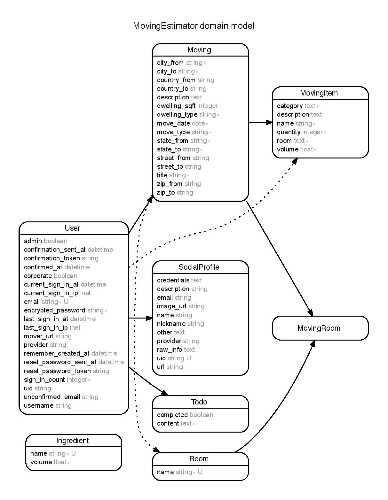

# Moving Estimator

- a web application with which users can estimate the volume of their household goods.
- estimates the volume based on the all the items that users input so that the users can obtain accurate volume to submit to a local moving company for a quote.

# Models

